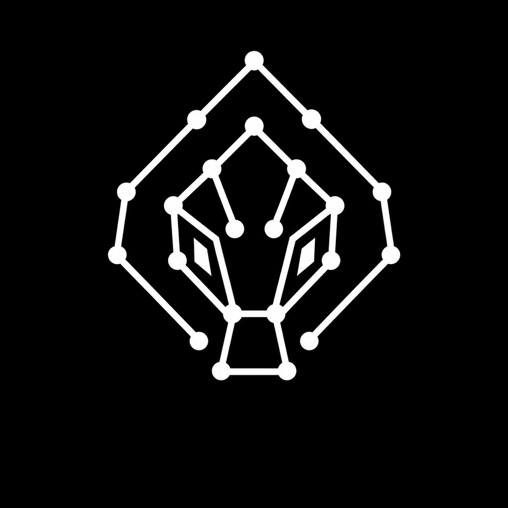

# NNAGA — Android Audio Effects Rack



NNAGA is a native, low-latency Android audio-effects rack and host for building, playing, and saving real-time processing chains.

> **Project status — fully vibe-coded fork.** NNAGA is maintained as a fully
> vibe-coded fork. Treat it as experimental: review changes, keep backups of
> presets, and validate every audio/device workflow on your own hardware before
> relying on it in a production or live setting.

Русскоязычное сообщество: [Telegram чат NNAGA](https://t.me/nnaga_chat).

## Capabilities

- Run independent effect chains on parallel tracks, then process their mix through a dedicated master chain
- Record and loop tempo-quantized track takes with independent input arming, channel selection, gain, playback, and loop controls
- Load WAV files into tracks and synchronize their playback through the shared transport
- Chain and reorder LV2 effects in a rack
- Load neural amp models through NAM and AIDA-X plugins
- Save and restore presets
- Open plugin editors through Android UI, WebView, or the native X11/EGL compatibility layer
- Host Windows VST2/VST3 plugins through Wine/FEX in the `full` flavor

## Getting started

NNAGA targets Android 8.0 (API 26) and newer on `arm64-v8a`. A local build requires JDK 17, Android SDK Platform 35, Android NDK `27.2.12479018`, CMake `3.22.1`, and these host packages:

```text
ninja-build meson python3 python3-mako pkg-config autoconf automake libtool gettext patch cmake flex bison ocaml ocamlbuild ocaml-findlib libnum-ocaml-dev
```

Initialize the pinned dependencies before building:

```sh
git submodule update --init --recursive
```

### Build with Make

`make help` prints the available targets. The native targets delegate to `build.sh`; Android packaging uses the Gradle wrapper.

| Target | Purpose |
| --- | --- |
| `make native` | Build native libraries with the default (`full`) setup |
| `make full` | Build native libraries for the `full` flavor |
| `make playstore` | Build native libraries and Play Store asset-pack layout |
| `make debug` | Build and, when a device is available, install/start the full debug app |
| `make release` | Build the full release APK/AAB and optionally install/start the APK |
| `make assemble-full-debug` | Assemble the full debug APK |
| `make assemble-full-release` | Assemble the signed full release APK |
| `make assemble-playstore-debug` | Assemble the Play Store debug APK |
| `make assemble-playstore-release` | Assemble the signed Play Store release APK |

All Android packaging targets require these private properties in `~/.gradle/gradle.properties`:

```properties
RELEASE_STORE_FILE=/private/path/to/upload.keystore
RELEASE_STORE_PASSWORD=...
RELEASE_KEY_ALIAS=...
RELEASE_KEY_PASSWORD=...
```

Do not commit the keystore or its passwords. Every Android variant uses this signing configuration, and packaging fails when any `RELEASE_*` property is missing or the keystore path is not a file.

NNAGA reads its authoritative application version from root `version.properties`,
which contains only `VERSION_NAME` (strict SemVer) and `VERSION_CODE`
(independent Android/Play ordering integer). Release tags use `v<VERSION_NAME>`.

The dashboard's clean display suffix counts Git commits since the latest commit
that introduced the current exact `VERSION_NAME` line. Count `0` is empty;
positive counts use spreadsheet-style lowercase base-26 (`1=a`, ..., `26=z`,
`27=aa`). Changing `VERSION_NAME` resets the baseline; history rewrites and
cherry-picks recompute it from the resulting history. For dirty worktrees,
status is computed with `git status --porcelain=v1 --untracked-files=all
--ignore-submodules=dirty`, and the dashboard appends `-dirty-<letter>` using
the same spreadsheet mapping (`1=a`, ..., `26=z`, `27=aa`). The root ignored
`dirty.version` stores the next local dirty-build index (missing means `1`),
incremented exactly once atomically after a successful local Gradle graph
containing an app assemble/bundle task. It is never changed during
configuration, failed or clean graphs, or GitHub Actions.

Display suffixes are not SemVer and never alter package metadata, canonical
artifact names, or tags. Canonical Android artifacts are versioned under:


- `app/build/outputs/versioned/apk/<variant>/nnaga-<version>-<variant>.apk`
- `app/build/outputs/versioned/bundle/<variant>/nnaga-<version>-<variant>.aab`

Variants include `fullDebug`, `fullRelease`, and `playstoreRelease`.

For full release and Play Store publishing flow, checksum rules, and release
checklists, follow [`docs/RELEASING.md`](docs/RELEASING.md).

## Distribution flavors
| Flavor | Target SDK | VST host | Asset packs | Intended distribution |
| --- | ---: | --- | --- | --- |
| `full` | 28 | Included | Disabled | Sideloaded builds, including the optional Wine/FEX stack |
| `playstore` | 35 | Omitted | Enabled | Play Store packaging |

The flavor boundary is intentional: `full` includes the VST host dependency, while `playstore` does not.

## Direct USB audio

NNAGA's core fork feature is direct USB Audio Class (UAC) transport through [`liblowlatencyaudio`](https://github.com/patlach42/liballa), a standalone C++17 driver also included as this repository's `liblowlatencyaudio/` submodule. Android grants permission and supplies the `UsbDeviceConnection`; the driver borrows its file descriptor and manages the claimed UAC interfaces.

On the documented Audient iD4 MKII profile — 48 kHz, 16-frame buffer, period multiplier 3 — the driver observed **6.52–7.21 ms** of host-queue latency across eight 30-second runs: roughly **6–8 ms**. This is not end-to-end latency: ADC/DAC conversion, device FIFO, analog loopback, and acoustic latency are excluded. Other interfaces use conservative defaults until measured and calibrated.

The rack is a parallel audio graph: every track has its own effect chain, input arm/channel, volume, file/loop playback, and transport state; their mix then runs through a separate master-effects chain. The built-in looper records a selectable number of bars, enters on a quantized transport boundary, and can start playback at bar, quarter-note, or eighth-note boundaries.

The direct-USB path owns the USB interfaces for the session. Do not route the same interface through Android `AudioTrack`/`AudioRecord`, and keep the Java `UsbDeviceConnection` alive until native stop and close finish.

## Architecture and project map

- `app/src/main/java/com/vibes/dsp/` — Kotlin/Jetpack Compose UI, lifecycle, settings, and USB management
- `app/src/main/cpp/` — C++17 audio engine, rack, LV2 host, recording/playback, JNI bridge, and X11 compatibility layer
- `liblowlatencyaudio/` — standalone C++17 direct-USB transport
- `vsthost_lib/` — optional Wine/FEX Windows VST host used only by `full`
- `cmake/` — native Android cross-build for X11, LV2, and plugin dependencies
- `gxplugins_pack/`, `neural_pack/`, `brummer_pack/` — Play Asset Delivery packs
- `3rd_party/` — third-party sources, patches, and notices

The application owns the Android engine, rack, plugins, JNI, Kotlin/UI, and VST integration. The direct-USB component owns its transport, scheduling, rings, lifecycle, and diagnostics. Its detailed contract is in [`liblowlatencyaudio/README.md`](liblowlatencyaudio/README.md) and [`liblowlatencyaudio/AGENTS.md`](liblowlatencyaudio/AGENTS.md). Third-party inventory and notices are in [`3rd_party/README.md`](3rd_party/README.md).

## Release and trust resources

- [Release operator guide](docs/RELEASING.md) — signed APK, checksum, and Play Store workflow
- [Changelog](CHANGELOG.md) — NNAGA fork release notes
- [Privacy notice](docs/PRIVACY.md) — permissions, local data, and optional Tone3000 traffic
- [Support matrix](docs/SUPPORT_MATRIX.md) — platform baseline, USB evidence, and report fields
- [SBOM and licensing guide](docs/SBOM_AND_LICENSES.md) — source provenance and third-party notices
- [Reproducible builds](docs/REPRODUCIBLE_BUILDS.md) — comparable-build procedure and limits

## Contributing

Start with [`AGENTS.md`](AGENTS.md) for repository structure, conventions, and development commands. [`UI_SPEC.md`](UI_SPEC.md) records the available UI behavior and terminology. Keep changes within the ownership and licensing boundaries described above.

## Fork provenance

NNAGA is a fork of [Guitar RackCraft](https://github.com/Varcain/GuitarRackCraft),
originally published by [Varcain](https://github.com/Varcain). Thank you to the
original author and every upstream contributor whose work remains part of this
project. Their copyright notices and license terms are retained.

## Licensing and attribution

NNAGA and project-owned code are distributed under GPL-3.0-or-later; see [`LICENSE`](LICENSE). The direct-USB component has its own GPL-3.0-or-later license at [`liblowlatencyaudio/LICENSE`](liblowlatencyaudio/LICENSE). Third-party code remains under its original terms and is not relicensed by NNAGA; preserve the notices and license files in [`3rd_party/`](3rd_party/) and the bundled libusb notices when redistributing binaries.

NNAGA Not Android Guitar App
